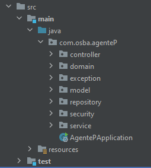

El servidor del bakend corre sobre tomcat haciendo uso de springboot, el cual se conecta a la base de datos en postgresql.

## Dependencias
Para el proyecto se usan las siguientes dependencias:
- Spring Web
- Spring Data JPA
- Spring Security
- PostgreSQL Driver
- Lombok
- Spring Boot DevTools
- Java 17

## Estructura de carpetas
En el proyecto se tiene la siguiente estructura de carpetas:

### controller
Se guardan todos los controladores, estos se crearan dependiendo su funcionalidad, ya sea por entidad (tabla de la bd), o por funcionalidad (auth, datawherahouse, etc).

### domain
Se guardan las clases que representan las entidades de la base de datos. Estas pueden ser retornadas por los controladores o usadas por los repositorios y servicios.

### exception
Se guardan las clases que representan las excepciones que se pueden generar en el proyecto.

### model
Se guardan las clases que representan los modelos de los objetos que se usan en el proyecto, estos no estan en la base de datos pero pueden ser los que reciban y retornen los controladores.

### repository
Se guardan las interfaces que representan los repositorios de las entidades de la base de datos.
[Aprende más sobre los JPA Repositories](https://docs.spring.io/spring-data/jpa/docs/current/reference/html/#jpa.repositories)

### security
Se guardan las clases que engloban la autenticacion y seguridad tanto del proyecto cómo los datos.

### service
Se guardan las clases que representan los servicios de las entidades de la base de datos. Aquí definimos la logica de alguna de las consultas más complejas que los repositorios no pueden hacer.

## Guia de estilo

### Nombres de paquetes
- Los nombres de los paquetes deben ser en minúsculas y no deben contener caracteres especiales ni guiones bajos.

### Nombres de clases
