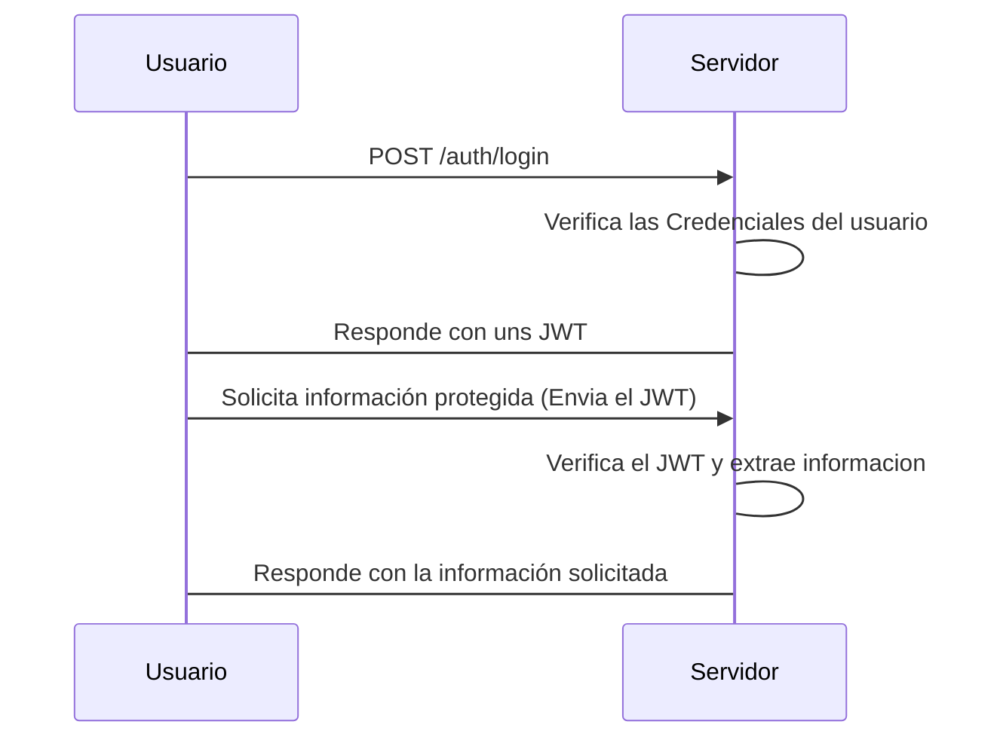
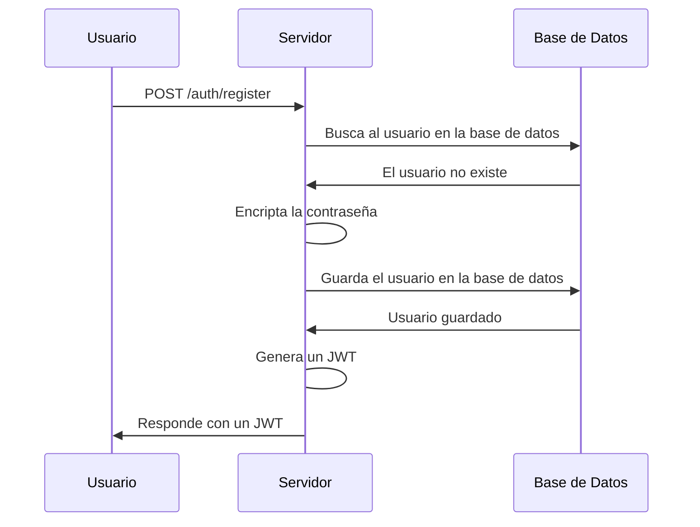

# Registro de usuarios e inicio de sesión
Link: [Link a este design doc](#)

Author(s): Humberto Antonio Salinas Cortés

Status: In progress

Ultima actualización: 2023-05-12

## Contenido
- Goals
- Non-Goals
- Background
- Overview
- Detailed Design
  - Solucion 1
    - Frontend
    - Backend
  - Solucion 2
    - Frontend
    - Backend
- Consideraciones
- Métricas

## Links
- [Implementing JSON Web Token (JWT) Authentication using Spring Security | A Detailed Walkthrough](https://medium.com/geekculture/implementing-json-web-token-jwt-authentication-using-spring-security-detailed-walkthrough-1ac480a8d970)

## Objetivo

Endpoint para el inicio de sesion de los empleados. Este endpoint debe de recibir un usuario y contraseña, y regresar un token de autenticación (JWT).

Se busca hacer dicho endpoint con el fin de autenticar usuarios y poder dar acceso a recursos protegidos.

## Goals
- Iniciar sesión
- Registrar usuario
- Obtener token de autenticación
- Proteger recursos
## Non-Goals
- Inicio de sesión con OAuth2

## Background
El proyecto tiene información sensible que no todo el mundo en internet devería ver, incluso, dentro de la orgaización hay información que no todos los empleados deberían ver. Por lo tanto, se busca proteger los recursos de la aplicación para que solo los usuarios autorizados puedan acceder a ellos.

Investigando un poco, encontramos que hay varias formas, entre ellas, dos resaltan demasiado, el uso de api keys y el uso de tokens de autenticación. La primera es muy sencilla de implementar, pero no es muy segura, ya que si alguien intercepta la api key, puede hacerse pasar por el usuario. La segunda es un poco más compleja, pero es más segura, ya que el token de autenticación es generado por el servidor y es firmado digitalmente, agregando un tiempo de expiración, de esta forma, si alguien intercepta el token, solo podrá hacerse pasar por el usuario por un tiempo limitado.

Una estandar en web para el manejo de estos tokens son los JSON Web Tokens (JWT), por lo que se buscará implementar un sistema de autenticación basado en JWT.

### JSON Web Token (JWT)
JSON Web Token es un estandard de internet para compartir información segura entre dos partes. La información se comparte en forma de JSON, y puede ser verificada y confiable debido a que es firmada digitalmente. Los JWTs pueden ser firmados usando un secreto o un par de llaves pública/privada usando un algoritmo de encriptación.

`eyJhbGciOiJIUzI1NiIsInR5cCI6IkpXVCJ9`.`eyJzdWIiOiIxMjM0NTY3ODkwIiwibmFtZSI6IkpvaG4gRG9lIiwiaWF0IjoxNTE2MjM5MDIyfQ`.`FGK5PCL49k3jfNCq6wZtn6T-uG9Dv4hOYIm55xTux8w`

Header.Payload.Signature

#### Header
Esta parte contiene dos propiedades, el tipo de token (JWT) y el algoritmo de encriptación usado (HMAC SHA256 o RSA).

```json
{
  "alg": "HS256",
  "typ": "JWT"
}
```

#### Payload
Contiene la informacion que se desea compartir mediante el JWT, tiene campos definidos como:
- iss (issuer): Emisor del JWT
- sub (subject): Sujeto del JWT
- aud (audience): Audiencia del JWT
- exp (expiration time): Tiempo de expiración del JWT

Pero tambien puedes colocarle campos personalizados

```json
{
  "sub": "1234567890",
  "name": "John Doe",
  "role": "Recursos_Humanos",
}
```

#### Signature
Es la firma es creada tomando los textos codificados en base64 del header y payload, y un secreto, el algoritmo especificado en el header es usado para crear la firma.

```
HMACSHA256(
  base64UrlEncode(header) + "." +
  base64UrlEncode(payload),
  secret)
```


### [Modelo Físico de la Tabla empleado](https://github.com/Base-de-Datos-II-CO02-Semestre-2023a/docs/blob/main/02modeloFisico.md#tabla-empleado)


## Overview

Se constará de dos endpoints
- auth/login - Autentica las credenciales y genera un JWT
- auth/register - Registra un nuevo usuario y responde con un JWT


## Detailed Design
El flujo de la authenticacion

El flujo del registro



## Solución
### Empleado
Se implementa la entidad Empleado.
```java
@Entity
@Table(name = "empleado")
@Getter
@Setter
@ToString
@NoArgsConstructor
public class Empleado {
    @Id @GeneratedValue(generator = "empleado_id_seq")//Indica el nombre del generador
    @SequenceGenerator(name = "empleado_id_seq", sequenceName = "empleado_id_seq", allocationSize = 1)//Indica el nombre de la sequencia en la BD sobre la que trabajará el generador
    private Integer id;
    private String nombre;
    private BigInteger telefono;
    private String correo;
    private Integer codigoPostal;
    private String idCiudad;
    private String calle;
    @Nullable//Indica que el valor puede ser nulo
    private Integer numeroInterno;
    @Nullable
    private Integer numeroExterno;
    private BigInteger nss;
    @JsonProperty(access = JsonProperty.Access.WRITE_ONLY)
    private String password;
    private String rfc;
    private Date fechaDeNacimiento;
    private Date fechaDeIngreso;
    @Nullable
    private Integer contrato;
    private float indiceProductividad;

}
```

Se implementa el repositorio de la entidad Empleado.
```java
public interface EmpleadoRepository extends JpaRepository<Empleado, Integer> {
    public Optional<Empleado> findByRfc(String rfc);
    public Optional<Empleado> findByNss(String nss);
    public Optional<Empleado> findByEmail(String email);
    public Optional<Empleado> findByTelefono(String telefono);
    public Optional<Empleado> findById(Integer id);
}
```
Podemos notar que se implementa un método para buscar un empleado por cada una de los campos que tengar un valor único, en este caso son: rfc, nss, email, telefono y id.

Unicamente para metodos de prueba de protección de los endpoints se implementa el endpoint `/empleados` que posteriormente puede desaparecer y sustituirse por algun otro, para esto implementamos la clase EmpleadoController.
```java
@RestController
@RequestMapping("/empleados")
public class EmpleadoController {
```
En esta parte del codigo le indicamos que el endpoint `/empleados` es manejado por esta clase.

```java
    @Autowired
    private EmpleadoRepository empleadoRepository;
```
En esta parte del codigo le indicamos que se inyecte el repositorio de la entidad Empleado.

```java
    @GetMapping()
    public List<Empleado> getEmpleados(){
        return empleadoRepository.findAll();
    }
```
Aquí se implementa el método para obtener todos los empleados.

Este endpoint estará restringido unicamente a los empleados que tengan alguno de los siguientes puestos:
- Admin
- Recursos_Humanos
- Finanzas

### Autenticacion
Para la implementacíon importante, la autenticacion, se crean los archivos `JWT Filter`, `JWTUtil`, `MyUserDetailService`, `SecurityConfig` y `AuthController`.
Procedemos a explicar cada uno de ellos.

`JWTUtil` es la clase que se encarga de generar los JWT, así como su verificación.

`JWTFilter` es la clase que se encarga de filtrar las peticiones que se hacen a los endpoints, para verificar que el JWT sea valido.

`MyUserDetailService` es la clase que se encarga de obtener los datos del Empleado propietario del JWT.

`SecurityConfig` es la clase que se encarga de configurar la seguridad de los endpoints.

`AuthController` es la clase que se encarga de manejar los endpoints de autenticación.

Para genera el token.
```java
public String generateToken(String id) throws IllegalArgumentException{
        Date date = new Date();

        return JWT.create()
                .withSubject("User Details")
                .withClaim("id", id)
                .withIssuedAt(new Date())
                .withIssuer("osba")
                .sign(Algorithm.HMAC256(secret));
    }
```

Método que verifica el token.
```java	
public String validateTokenAndRetrieveSubject(String token) throws IllegalArgumentException{
        JWTVerifier jwtVerifier = JWT.require(Algorithm.HMAC256(secret))
                .withSubject("User Details")
                .withIssuer("osba")
                .build();

        DecodedJWT decodedJWT = jwtVerifier.verify(token);
        return decodedJWT.getClaim("id").asString();
    }
```

Para la configuración de la seguridad de los endpoints.

Colocamos un filtro de cadena de seguridad, en el cual se indica que se deshabilita el csrf, httpBasic, se habilita cors, se indica que el endpoint `/auth/login` es publico, se indica que los endpoints `/empleados` y `/auth/register` es accesible unicamente por los empleados con los puestos `Recursos_Humanos`, `Admin` y `Finanzas`, y se indica que cualquier otro endpoint es denegado.
```java
@Bean
    public SecurityFilterChain filterChain(HttpSecurity http) throws Exception{
        http.csrf().disable()
                .httpBasic().disable()
                .cors()
                .and()
                .authorizeHttpRequests((authorize) -> authorize
                    .requestMatchers("/auth/register").permitAll()
                    .requestMatchers("/empleados","/auth/login").hasAnyAuthority("Recursos_Humanos", "Admin","Finanzas")
                    .anyRequest().denyAll()
                )
                .userDetailsService(userDetailService)
                .exceptionHandling()
                    .authenticationEntryPoint( (request, response, authException) ->
                        response.sendError(HttpServletResponse.SC_UNAUTHORIZED, "No autorizado")
                )
                .and()
                .sessionManagement((session) -> session.sessionCreationPolicy(SessionCreationPolicy.STATELESS));

        http.addFilterBefore(jwtFilter, UsernamePasswordAuthenticationFilter.class);
        http.httpBasic(withDefaults());

        return http.build();
    }

```
Se indica que usamos el Codificador BCrypt para las contraseñas.

 Se crea un AuthenticationManager personalizado, en el cual se indica que se verifica que la contraseña sea correcta, y que el usuario este activo.


### Endpoints de autenticación
Se implementan los endpoints de autenticación en la clase `AuthController`.

#### /auth/register
Este endpoint es maneja únicamente peticiones de tipo `POST` para registrar un nuevo empleado, solo los empleados con puesto `Recursos_Humanos` o `Admin` pueden hacer uso del endpoint.

Regresa un token de sesión.
Ejemplo de petición:

```java
POST /auth/register HTTP/1.1
Host: {host}:{port}
Content-Type: application/json
Authorization: Bearer {token}
Content-Length: 421

{
    "nombre": "Juan",
    "telefono":7555555555,
    "correo":"ejem4545plodk@sl.ls",
    "codigoPostal":50000,
    "idCiudad":"TOL",
    "calle":"calle",
    "numeroInterno":null,
    "numeroExterno":6,
    "nss":123445567,
    "password":"123456789",
    "rfc":"ejemploderfc",
    "fechaDeIngreso":"2019-01-01",
    "fechaDeNacimiento":"2000-01-01",
    "contrato":null,
    "indiceEroductividad":0.9
}
```

#### /auth/login
Se manejan peticiones de tipo `POST` para iniciar sesión, de momento solo se pued iniciar sesión con el `rfc` del empleado y la `contraseña`.
Regresa un token de sesión.
```java
POST /auth/login HTTP/1.1
Host: {host}:{port}
Content-Type: application/json
Authorization: Bearer {token}
Content-Length: 421

{
    "password":"123456789",
    "rfc":"ejemploderfc",
}
```


## Consideraciones

Solo inicia sesion con el rfc

## Trabajo a futuro (Muy lejano)A¿
- Que utilize mas campos para iniciar sesion	
- Implementar 2FA
