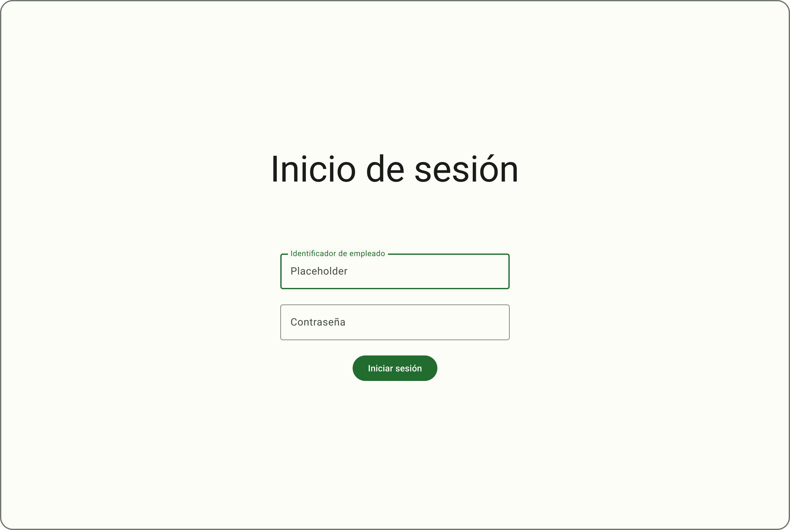
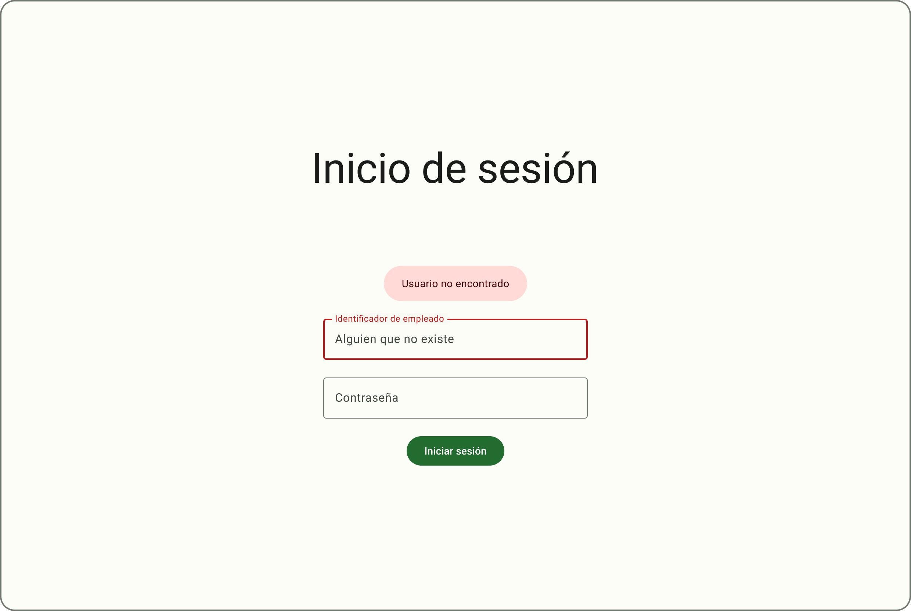

Cuando un usuario quiere iniciar sesion en la aplicacion sucede lo mostrado en el siguiente diagrama de secuencia:

``` mermaid
sequenceDiagram
    actor U as User
    participant C as Client
    participant S as Server
    U->>C: open /
    activate C
    alt is logged
        C->>U: redirect /home
    else is not logged
        C->>U: show login form
        deactivate C
        U->>C: send login form
        activate C
        C->>S: post /login
        activate S     
        alt login ok
            S->>C: response 200, token, rfc, puesto
            C->>U: redirect /${puesto}
        else login fail
            S->>C: response 401, error
            deactivate S
            C->>U: show login form with error
        end
    end
    deactivate C
 ```

 Por lo que debemos mostrar un formulario de login y enviarlo al servidor, el cual nos respondera con un token de sesion y el puesto del usuario, si el login es correcto, o un error si no lo es.

 Cómo solucion proponemos la siguiente pantalla:

Que a su vez tiene una pequeña variante para mostrar los mensajes de error:

 
Si se analiza a fondo se compone de 4 componentes:
- Un [DisplayLarge](./componentes/DisplayLarge.md)


- Dos [TextField](./componentes/TextField.md)


- Un [Button](./componentes/Button.md)


- Un [ErrorDialog](./componentes/ErrorDialog.md)


Al cargar la pantalla, se efectua la verificación si es que el usuario habia iniciado sesion previamente
``` javascript

export const loader: LoaderFunction = async ({ request }:LoaderArgs) => {
    const [token] = await getUserSession(request);

    if (token) {
        return redirect('/');
    }
    return null;
}
```

cómo podemos ver 